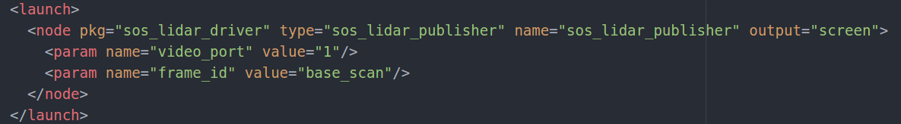

## SOS LIDAR ROS PACKAGE
ROS node and test application for SOS LIDAR

SOS LIDAR github:  https://github.com/DeokYun/SOS_LiDAR

## INSTALL DEPENDECIES
    1) sudo apt-get install v4l-utils
    2) sudo apt-get install libv4l-dev

## HOW TO BUILD SOS LIDAR ROS PACKAGE

1) Clone sos_lidar_driver folder to your catkin's workspace src folder
2) Running catkin_make 
    

## HOW TO RUN SOS LIDAR ROS PACKAGE
#### 1. Check the video port of a sos lidar
    ls /dev/video*
    
#### 2. Change video port parameter to your video port of a sos lidar
  sos_lidar.launch file is in sos_lidar_driver/launch folder

  

  Change video_port value to your video port of a sos lidar
    
    
#### 3. Run sos_lidar_publisher node and view in the rviz
    roslaunch sos_lidar_driver sos_lidar_viewer.launch
    
## HOW TO RUN SLAM WITH GMAPPING
#### 1. Run sos_lidar_publisher node on ROBOT PC
    rosrun sos_lidar_driver sos_lidar_publisher 
    
#### 2. Run Gmapping node and rviz on REMOTE PC
    roslaunch sos_lidar_driver view_gmapping.launch
    
## HOW TO RUN SLAM WITH HECTOR SLAM
#### 1. Run sos_lidar_publisher node on ROBOT PC
    rosrun sos_lidar_driver sos_lidar_publisher 
    
#### 2. Run Hectormapping node and rviz on REMOTE PC
    roslaunch sos_lidar_driver view_hectorSlam.launch

